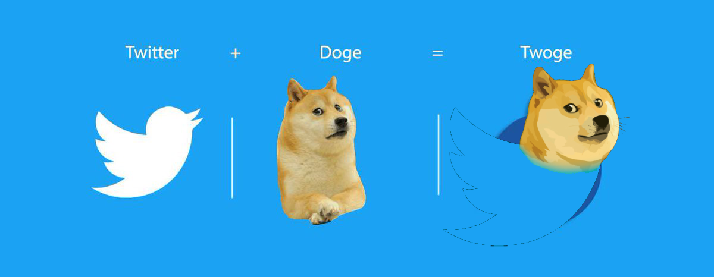

# Deployment Guide

## VPC (Virtual Private Cloud)

Create a VPC with two public subnets.

## Security Group

Create a security group that allows inbound access for HTTP, SSH, and PostgreSQL.

SSH  | TCP | 22   | 0.0.0.0/0

HTTP | TCP | 80   | 0.0.0.0/0

PSQL | TCP | 5432 | RDS IP?

## EC2 (Elastic Cloud Compute)

1. Create an Ubuntu instance with SSH and HTTP access.

2. SSH into the instance and install dependencies:

```sh
sudo yum update -y

sudo yum install git -y

git clone https://github.com/chandradeoarya/twoge.git

cd twoge

python3 -m venv venv

source venv/bin/activate

pip install -r requirements.txt
```

3. Create AMI.

## RDS (Relational Database Service)

1. Create a .env file in root of twoge directory:

```sh
nano .env
```

2. Add the PostgreSQL database URL:

```sh
SQLALCHEMY_DATABASE_URI = "PostgreSQL database URL"
```

## Daemon

1. Create the service file:

```sh
nano twoge.service
```

2. Add the following contents:

```sh
Description=Gunicorn instance to serve twoge

Wants=network.target
After=syslog.target network-online.target

[Service]
Type=simple
WorkingDirectory=/home/ec2-user/twoge
Environment="PATH=/home/ec2-user/twoge/venv/bin"
ExecStart=/home/ec2-user/twoge/venv/bin/gunicorn app:app -c /home/ec2-user/twoge/gunicorn_config.py
Restart=always
RestartSec=10

[Install]
WantedBy=multi-user.target'
```

3. Move the service file to the correct directory and activate it:

```sh
sudo cp twoge.service /etc/systemd/system/twoge.service

sudo systemctl daemon-reload

sudo systemctl enable twoge

sudo systemctl start twoge

sudo systemctl status twoge
```

## AWS Services & their purpose for Twoge

1. AWS EC2 (Elastic Compute Cloud) to host the application.
2. AWS S3 (Simple Storage Service) to store static files, such as images, videos, and other assets.
3. AWS IAM (Identity & Access Management) to manage access and permissions to AWS resources.
4. AWS VPC (Virtual Private Cloud) to create a secure and isolated network environment.
5. AWS ALB (Application Load Balancer) to distribute incoming traffic across multiple EC2 instances.
6. AWS ASG (Auto Scaling Group) to automatically scale EC2 instances up or down based on the demand.
7. AWS SNS (Simple Notification Service) to receive notifications about the app's performance & health.
8. AWS RDS (Relational Database Service) for the database.

<br>
<br>

<div align="center">
 
 <h3>Twoge</h3>
 <p>A social media platform dedicated solely to tweets about Dodge.</p>
</div>

<div align="center">
 
 <p>This application is built using Flask, SQLAlchemy, and PostgreSQL.</p>
</div>
